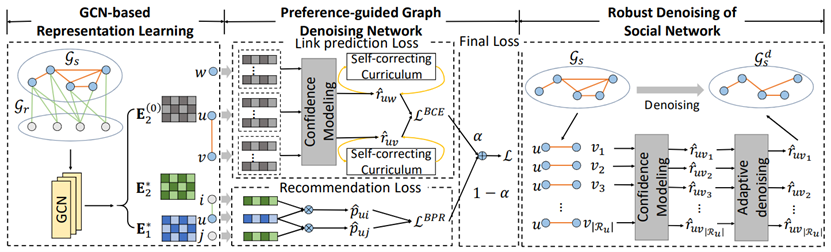

# GDMSR

This is the official implementation of the WWW 2023 paper **Robust Preference-Guided Denoising for Graph based Social Recommendation**.

In this paper, we instead propose to improve graph based social recommendation by only retaining the informative social relations to ensure an efcient and efective infuence difusion, i.e., graph denoising. Our designed denoising method is preference-guided to model social relation confdence and benefts user preference learning in return by providing a denoised but more informative social graph for recommendation models. Moreover, to avoid interference of noisy social relations, it designs a self-correcting curriculum learning module and an adaptive denoising strategy, both favoring highly-confdent samples. Experimental results on three public datasets demonstrate its consistent capability of improving three state-of-the-art social recommendation models by robustly removing 10-40% of original relations. 

## Architecture

## Environment
- Tested OS: Linux
- Python >= 3.7
- PyTorch == 1.7.1

## Data

We provide all three datasets we used in our experiments, all in the `data` folder

For each dataset, in addition to the u-i and u-u relation data, we also provide the negative samples used to calculate the metrics, as well as some other pre-processed data to reduce computation, such as `user_item_dict.pkl`, `user_visited_dict.pkl` and `visited_and_mask_matrix_30.pkl`.

For the new dataset, we have provided the data processing code that you can use by input the u-i and u-u relation data in `data_process.py`

## Model Training
To run the experiments, the scripts we provide can be used directly:

``
./run.sh
``

